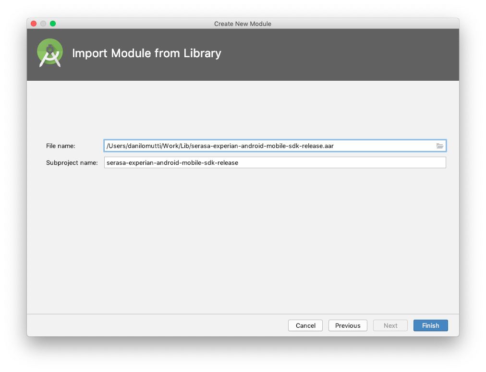
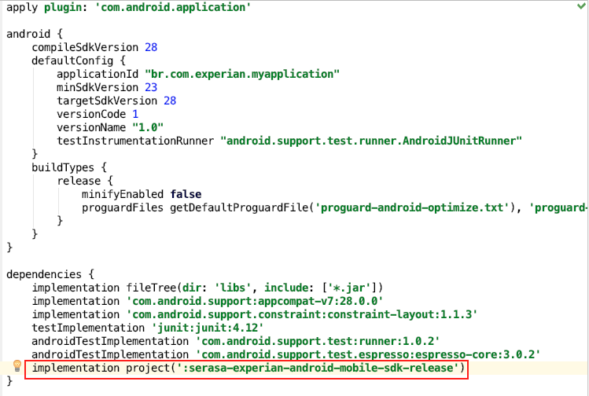
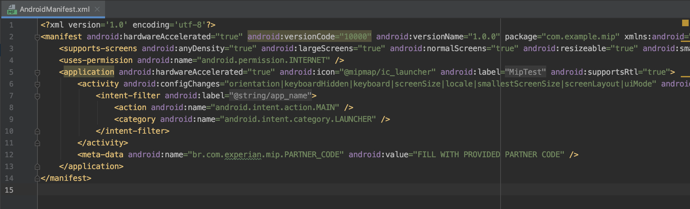

# Guia de integração com CORDOVA

O objetivo deste manual descreve o processo de integração do MIP-SDK em qualquer aplicativo CORDOVA. O SDK visa coletar informações para ajudar a combater a expansão do COVID-19.

Este manual usa o ambiente de referência do IDE **Android Studio 3.6** em execução no sistema operacional **macOS Mojave**.

Este guia mostra como criar um aplicativo Cordova e integrá-lo ao SDK do Android MIP.

# Requerimentos técnicos

O aplicativo requer o parâmetro **minSdkVersion** configurado como `minSdkVersion 16`. Este manual foi construído usando o IDE **Android Studio 3.3** no sistema operacional **macOS Mojave**. O Cordova CLI (ferramenta de linha de comando) é distribuído como um pacote npm, também é necessário compilar o aplicativo.

Para criar e executar aplicativos, você precisa instalar SDKs para cada plataforma que deseja segmentar. Execute `requisitos do cordova`, para verificar se o ambiente nao apresenta problemas.

## Criar projeto CORDOVA

Vá para o diretório em que você mantém seu código-fonte e crie um projeto cordova:

`cordova create mip com.example.mip MipTest`

Isso cria a estrutura de diretórios necessária para o seu aplicativo cordova. Por padrão, o script de criação cordova gera um aplicativo base web cuja home page é o arquivo www/index.html.

## Adicionar plataforma Android ao projeto

Todos os comandos subseqüentes precisam ser executados no diretório do projeto ou em qualquer subdiretório:

* `cd  mip`
* `cordova platform add android`

Para verificar seu conjunto atual de plataformas:

* `cordova platform ls`

Ok, é isso.

## Integração MIP

Abra o Android Studio e importe o SDK do Android MIP fornecido pela Serasa Experian.

* A integração deve ser feita no diretório criado dentro da plataforma `android`.


Existe uma classe chamada `ExpMobileInsightsPlatform`, é o principal ponto de integração com a plataforma MIP.

* Abra o diretório `android` no android studio.
* Importe SDK para Android MIP fornecido pela Serasa Experian.




* Adicione a dependência do módulo ao arquivo gradle.



É isso, agora é hora de fazer alterações no código. Mas primeiro uma pequena explicação ...

### Configuração dos metadados COVID do MIP SDK

Esses dados são importantes porque, através dele, o MIP-SDK redirecionará os dados coletados para combater a expansão do COVID-19.

Para configurar esse parâmetro, adicione a linha abaixo na tag `<application>` do arquivo `AndroidManiferst.xml` do aplicativo no qual o SDK será integrado.

* `<meta-data android:name="br.com.experian.mip.PARTNER_CODE" android:value="COVID"/>`

Defe ser feito dentro do arquivo de manifesto.



Preencha o campo com `COVID`.

### Termos e Condições

Para que a coleta de dados seja realizada, o SDK MIP-SDK deve ser notificado de que o local coletado será usado para combater a expansão do COVID-19, essas informações devem ser apresentadas nos **Termos e Condições** do aplicativo no qual o SDK foi integrado e aceito pelo usuário.

Para fazer isso, use o método abaixo, que pertence à classe `br.com.experian.android.mobile.sdk.library.core.ExpMobileInsightsPlatform`:

* `userAcceptedDataForGoodAgreement ()` - sinaliza que os dados serão usados ​​para combater o COVID-19.

## Requisitar a localização

Para que a MIP SDK colete a localização o aplicativo deve ter acesso a mesma, para requisitar acesso a localização basta incluir as linhas abaixo no aplicativo:

Arquivo `AndroidManifest.xml`

```xml
<manifest ... >
  <uses-permission android:name="android.permission.ACCESS_COARSE_LOCATION" />
</manifest>
```

```java
boolean permissionAccessCoarseLocationApproved =
    ActivityCompat.checkSelfPermission(this, permission.ACCESS_COARSE_LOCATION)
        == PackageManager.PERMISSION_GRANTED;

if (permissionAccessCoarseLocationApproved) {
   boolean backgroundLocationPermissionApproved =
           ActivityCompat.checkSelfPermission(this,
               permission.ACCESS_BACKGROUND_LOCATION)
               == PackageManager.PERMISSION_GRANTED;

   if (backgroundLocationPermissionApproved) {
       // App can access location both in the foreground and in the background.
       // Start your service that doesn't have a foreground service type
       // defined.
   } else {
       // App can only access location in the foreground. Display a dialog
       // warning the user that your app must have all-the-time access to
       // location in order to function properly. Then, request background
       // location.
       ActivityCompat.requestPermissions(this, new String[] {
           Manifest.permission.ACCESS_BACKGROUND_LOCATION},
           your-permission-request-code);
   }
} else {
   // App doesn't have access to the device's location at all. Make full request
   // for permission.
   ActivityCompat.requestPermissions(this, new String[] {
        Manifest.permission.ACCESS_COARSE_LOCATION,
        Manifest.permission.ACCESS_BACKGROUND_LOCATION
        },
        your-permission-request-code);
}
```

### Resumo

A coleta de dados só acontecerá se:

* Configurar-se o código do parceiro `COVID` no arquivo  `AndroidManiferst.xml`.
* Aceitar os ***Termos e condições*** e usar o método `userAcceptedDataForGoodAgreement()` para mostrar ao SDK que o usuário conhece a finalidade dos dados.
* Use as coletas contínuas ou instantâneas: `RunOneShotCollection ()` ou `scheduleContinuousCollection ()`.

### Examplo

```java
/*
       Licensed to the Apache Software Foundation (ASF) under one
       or more contributor license agreements.  See the NOTICE file
       distributed with this work for additional information
       regarding copyright ownership.  The ASF licenses this file
       to you under the Apache License, Version 2.0 (the
       "License"); you may not use this file except in compliance
       with the License.  You may obtain a copy of the License at

         http://www.apache.org/licenses/LICENSE-2.0

       Unless required by applicable law or agreed to in writing,
       software distributed under the License is distributed on an
       "AS IS" BASIS, WITHOUT WARRANTIES OR CONDITIONS OF ANY
       KIND, either express or implied.  See the License for the
       specific language governing permissions and limitations
       under the License.
 */

package com.example.mip;

import android.annotation.SuppressLint;
import android.os.AsyncTask;
import android.os.Bundle;
import android.util.Log;
import android.view.View;
import android.widget.ProgressBar;
import android.widget.Toast;
import org.apache.cordova.*;
import br.com.experian.android.mobile.sdk.library.core.CollectStatus;
import br.com.experian.android.mobile.sdk.library.core.ExpMobileInsightsPlatform;

public class MainActivity extends CordovaActivity
{

    private ExpMobileInsightsPlatform mip;

    @Override
    public void onCreate(Bundle savedInstanceState)
    {
        super.onCreate(savedInstanceState);

        Bundle extras = getIntent().getExtras();
        if (extras != null && extras.getBoolean("cdvStartInBackground", false)) {
            moveTaskToBack(true);
        }

        loadUrl(launchUrl);
        configureMipParameters();
        sendMipInfo();
    }

    private void configureMipParameters() {
        //Ponto de entrada da SDK
        mip = ExpMobileInsightsPlatform.getInstance();

        //versao do termos e condicoes aceito
        mip.privacyPolicy("1.0"); 

        //usuario aceitou a coleta dos dados
        mip.userAcceptedDataForGoodAgreement();
    }


    //nao deve ser feita a chamada as coletas dentro da thread principal.
    private void sendMipInfo() {

        AsyncTask<Void, Void, CollectStatus> async = new AsyncTask<Void, Void, CollectStatus>() {
            @SuppressLint("WrongThread")
            @Override
            protected CollectStatus doInBackground(Void... params) {
                try {
                    return mip.runOneShotCollection();

                } catch (Exception e) {
                    Log.e("name", "Error sending data", e);
                }

                return null;
            }

            @Override
            protected void onPostExecute(final CollectStatus result) {
                runOnUiThread(
                        new Runnable() {
                            @Override
                            public void run() {
                                if (result != null && result == CollectStatus.SUCCESS) {
                                    Toast.makeText(MainActivity.this, "Data sent", Toast.LENGTH_SHORT).show();

                                } else {
                                    Toast.makeText(MainActivity.this, "Error " + result, Toast.LENGTH_SHORT).show();
                                }
                            }
                        }
                );
            }
        };
        async.execute();
    }
}

``` 