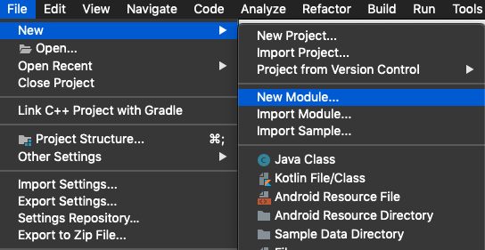
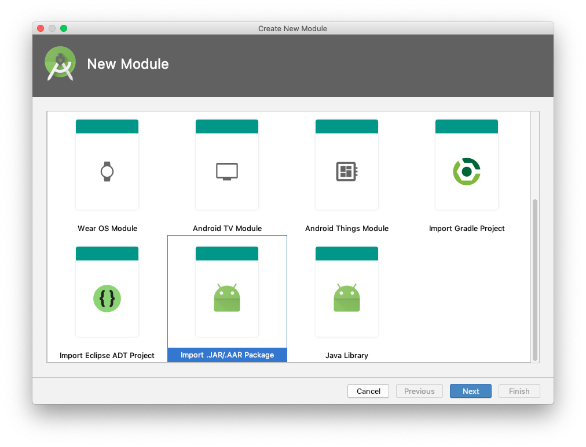
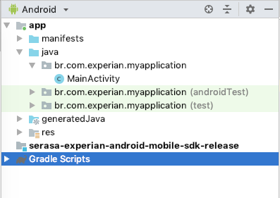
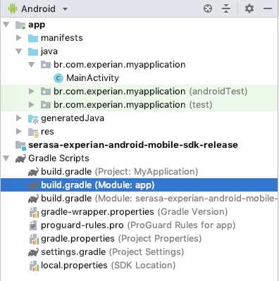

# Guia de Integração com a Mobile Insights Plataform 

O Objetivo desse manual descrever o processo de integração da MIP-SDK em qualquer aplicativo, a SDK tem como objetivo coletar informação para ajudar a combater a expansão do COVID-19.

Esse manual utiliza ambiente de referência a IDE **Android Studio 3.6** em execução no sistema operacional **macOS Mojave**. 

## Requisitos Técnicos

A MIP-SDK suporta a API level minimo 16 (Jelly Bean), lançada no fim de 2012. Qualquer versão de SDK Android igual ou superior ao 16 pode ser utilizado.

Basta que no `build.gradle` do aplicativo desejado, o parâmetro **minSdkVersion** esteja configurado como `minSdkVersion 16`.

# Passos para Integração

A MIP-SDK vai realizar a coleta da localização do telefone , encriptar e  anonimizar e enviar essas informações. Todos os itens detalhados abaixo são necessários para integrar a biblioteca corretamente.

## 1. Importação da biblioteca

O pacote entregue é composto por um arquivo com extensão `.aar` (Android Archive Library), que deverá ser adicionado ao projeto.

Para isso, acessar o menu `File -> New Module...`, conforme a figura abaixo.



No menu `New Module`, selecionar a opção `Import .JAR/.AAR Package`



Em seguida, devemos informar a localização do arquivo **.aar** enviado pela Serasa Experian.


Ao preenchermos o caminho (ou clicando no botão `...`), o campo **Subproject name** é automaticamente preenchido pela interface.

O próximo passo é acrescentar a dependência no arquivo de script `build.gradle`. Para isso, clique duas vezes em `Gradle Scripts` na interface e em seguida no arquivo `build.gradle (Module: app)`.





Com o arquivo `build.gradle` aberto, incluir a dependência do SDK no atributo `dependencies`, inserindo a linha `implementation project(':android-mobile-sdk-release')` conforme figura.


## 2. Configuração do metadado COVID da MIP SDK

Esse dado é importante pois através dele que a MIP-SDK vai redirecionar  os dados  coletados para  o combate a expansão do COVID-19.

Para configurar esse parâmetro, adicione a linha abaixo dentro da tag `<application>` do arquivo `AndroidManiferst.xml` do aplicativo no qual a SDK vai ser integrada.

* `<meta-data android:name="br.com.experian.mip.PARTNER_CODE" android:value="COVID"/>`

## 3. Especificação da finalidade de uso da localização

A Lei Geral de Proteção de Dados Pessoais (LGPD ou LGPDP), Lei nº 13.709/2018, é a legislação brasileira que regula as atividades de tratamento de dados pessoais e que também altera os artigos 7º e 16 do Marco Civil da Internet.

Para que a coleta de dados seja efetuada, o SDK MIP-SDK deve ser notificado que a localização  coletada  sera utilizada para combater a expansão do COVID-19, essa informação deve  ser apresentada nos **Termos e Condições** do aplicativo no qual a SDK foi integrada e que foi aceita pelo usuário. 

Para isso, utilize um ou mais métodos da classe `br.com.experian.android.mobile.sdk.library.core.ExpMobileInsightsPlatform`, listados abaixo:

* `userAcceptedDataForGoodAgreement()` - sinaliza que os dado sera utilizado para combater o COVID-19.

## 4. Versão do documento Termos e Condições

Além da finalidade, também é necessário estabelecer um vínculo entre o aceite da finalidade e os **Termos e Condições** apresentados. Para isso, utilize o método `privacyPolicy(String arg)` da classe `br.com.experian.android.mobile.sdk.library.core.ExpMobileInsightsPlatform`. O argumento pode ser a versão do documento, o hash do documento, a URL onde o documento está disponível ou a íntegra do próprio texto.

## 5. Integração ProGuard

Caso utilize a ferramenta ProGuard, é necessário adicionar a linha abaixo no arquivo de configuração.

```properties
-keep class br.com.experian.android.mobile.sdk.library.core.** { *; }
```

## 6. Efetuar o agendamento da coleta continua da localização

Para que o combate ocorra com efetividade é necessário agendar coleta continua da localização do usuário. É importante salientar que esse processo foi feito sem causar impacto na rede de dados e no consumo da bateria do celular do usuário.

Para agendar a execução da coleta de dados, é necessário chamar o método `scheduleContinuousCollection()` da classe `br.com.experian.android.mobile.sdk.library.core.ExpMobileInsightsPlatform` na atividade inicial da aplicação.

## 7. Extração Única da localização

O MIP-SDK tem como característica principal o respeito ao aplicativo dos seus parceiros. Por esse motivo, o processamento e envio dos dados costuma ocorrer em situações ótimas para o aparelho (carregando e conectado em rede Wi-Fi), o que pode ocasionar algum tempo adicional no envio dos dados. Para garantir pelo menos a primeira extração completa dos dados, é recomendável efetuar uma chamada do método `runOneShotCollection()`.

# Exemplo de Código de Integração

```java
package com.example.myapplication;

import android.support.v7.app.AppCompatActivity;
import android.os.Bundle;
import br.com.experian.android.mobile.sdk.library.core.CollectStatus;
import br.com.experian.android.mobile.sdk.library.core.ExpMobileInsightsPlatform;

public class MainActivity extends AppCompatActivity {

  private static final String TAG = "My Application";
  private final ExpMobileInsightsPlatform mip =
    ExpMobileInsightsPlatform.getInstance();

  @Override
  protected void onCreate(Bundle savedInstanceState) {
    super.onCreate(savedInstanceState);
    setContentView(R.layout.activity_main);

    //definicao do client code COVID
    mip.clientCode("COVID");

    //Aceite do termos e condicoes para ajudar no combate ao COVID
    mip.userAcceptedDataForGoodAgreement();
    mip.privacyPolicy("1.0");

    //agenda-se a coleta continua (em intervalos regulares) da localizacao para combater o  COVID
    mip.scheduleContinuousCollection();
    
    //faz uma coleta unica no instante da execucao da do  app.
    runOneShotCollection();
  }

  public void runOneShotCollection() {
    AsyncTask<Void, Void, CollectStatus> async =
      new AsyncTask<Void, Void, CollectStatus>() {
      @Override
      protected CollectStatus doInBackground(Void... params) {
        try {
          return mip.runOneShotCollection();

        } catch (Exception e) {
          Log.e(TAG, "Error sending data", e);
        }
        return null;
      }
      @Override
      protected void onPostExecute(final CollectStatus result) {
        Log.d(TAG, "Result [" + 
          (result != null && result == CollectStatus.SUCCESS)
        + "]");
      }
    };
    async.execute();
  }
}
```