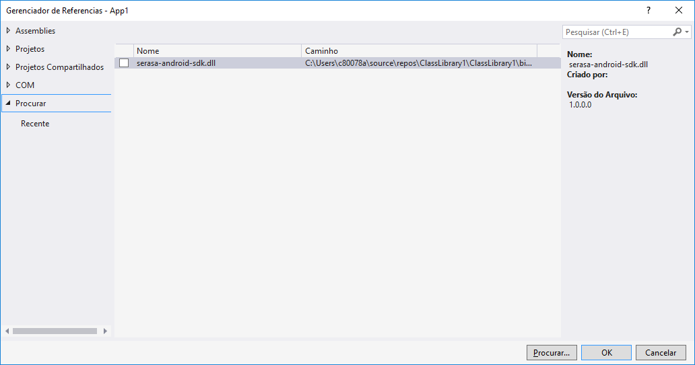

# Guia de Integração Serasa Experian Mobile SDK com XAMARIN

O Objetivo desse manual descrever o processo de integração da MIP-SDK em qualquer aplicativo, a SDK tem como objetivo coletar informação para ajudar a combater a expansão do COVID-19.

Esse manual utiliza ambiente de referência a IDE **Android Studio 3.6** em execução no sistema operacional **macOS Mojave**. 

Esse manual mostrará como integrar a SDK Android do Serasa Score Digital em um projeto XAMARIN.

## Requisitos Técnicos

Para criarmos o ambiente de testes precisamos de:

* Visual Studio com modulo para desenvolvimento Xamarin

## Criação do projeto XAMARIN

Para integrar a SDK em um projeto XAMARIN é necessário criar um projeto Android dentro do Visual Studio.

Crie um novo projeto e nomeie o novo projeto BindingTest.


Uma vez que o projeto esteja criado. Clique com o botão direito do mouse no nó referências do projeto BindingTest e selecione Adicionar referência:


## importação da DLL MIP

Selecione a DLL do MIP fornecida pela SERASA e clique em OK:



Feito isso temos associada a DLL do MIP em um projeto XAMARIN. Agora devemos fazer as devidas chamadas de código necessárias para o tipo de coleta de deseja.

O MIP, conforme mencionado em seu manual, possui dois tipos de coleta:

* A coleta contínua de dados: que coleta dados em intervalos regulares de tempo.
* A coleta única: coleta que ocorre apenas uma vez.

* Observação: _**as coletas devem rodar em uma thread que não seja a de UI.**_ 

## Integração com a plataforma MIP

A partir desse momento podemos fazer a integração através de um Wrapper chamado `ExpMobileInsightsPlatform`, ele é o responsável por executar a **SDK Score Digital**. 

### Aceite do termos e condições e LGPD

A Lei Geral de Proteção de Dados Pessoais (LGPD ou LGPDP), Lei nº 13.709/2018, é a legislação brasileira que regula as atividades de tratamento de dados pessoais e que também altera os artigos 7º e 16 do Marco Civil da Internet.

Para que a coleta de dados seja efetuada, o SDK MIP-SDK deve ser notificado sobre qual a finalidade dos dados apresentada nos **Termos e Condições** do aplicativo e que foi aceita pelo usuário. 

Para isso, utilize um ou mais métodos da classe `br.com.experian.android.mobile.sdk.library.core.ExpMobileInsightsPlatform`, listados abaixo:

* `userAcceptedDataForGoodAgreement()` - sinaliza que o dado sera utilizado para combater o COVID-19.

Além da finalidade, também é necessário estabelecer um vínculo entre o aceite da finalidade e os **Termos e Condições** apresentados. Para isso, utilize o método `privacyPolicy(String arg)` da classe `br.com.experian.android.mobile.sdk.library.core.ExpMobileInsightsPlatform`. O argumento pode ser a versão do documento, o hash do documento, a URL onde o documento está disponível ou a íntegra do próprio texto.

### Configuração do Partner Code COVID

Esse dado é importante pois através dele que a MIP-SDK vai redirecionar  os dados  coletados para  o combate a expansão do COVID-19.

Para configurar esse parâmetro, adicione a linha abaixo dentro da tag `<application>` do arquivo `AndroidManiferst.xml` do aplicativo no qual a SDK vai ser integrada.

Dentro do arquivo `AssemblyInfo.cs` insira a linha abaixo com o seu código de parceiro fornecido pela Serasa.

```c#
[assembly: MetaDada("br.com.experia.mip.PARTNER_CODE", Value = "COVID")]
```
## Requisitar a localização

Para que a MIP SDK colete a localização o aplicativo deve ter acesso a mesma, para requisitar acesso a localização basta incluir as linhas abaixo no aplicativo:

Arquivo `AndroidManifest.xml`

```xml
<manifest ... >
  <uses-permission android:name="android.permission.ACCESS_COARSE_LOCATION" />
</manifest>
```

```java
boolean permissionAccessCoarseLocationApproved =
    ActivityCompat.checkSelfPermission(this, permission.ACCESS_COARSE_LOCATION)
        == PackageManager.PERMISSION_GRANTED;

if (permissionAccessCoarseLocationApproved) {
   boolean backgroundLocationPermissionApproved =
           ActivityCompat.checkSelfPermission(this,
               permission.ACCESS_BACKGROUND_LOCATION)
               == PackageManager.PERMISSION_GRANTED;

   if (backgroundLocationPermissionApproved) {
       // App can access location both in the foreground and in the background.
       // Start your service that doesn't have a foreground service type
       // defined.
   } else {
       // App can only access location in the foreground. Display a dialog
       // warning the user that your app must have all-the-time access to
       // location in order to function properly. Then, request background
       // location.
       ActivityCompat.requestPermissions(this, new String[] {
           Manifest.permission.ACCESS_BACKGROUND_LOCATION},
           your-permission-request-code);
   }
} else {
   // App doesn't have access to the device's location at all. Make full request
   // for permission.
   ActivityCompat.requestPermissions(this, new String[] {
        Manifest.permission.ACCESS_COARSE_LOCATION,
        Manifest.permission.ACCESS_BACKGROUND_LOCATION
        },
        your-permission-request-code);
}
```

### Resumo

Em suma para que a SDK do MIP possa coletar a localização e ajudar no combate ao COVID-19 os passos abaixo devem estar corretos e concluídos:

* Aceitar os termos e condições e utilizar o método `userAcceptedDataForGoodAgreement()`.
* Informar a versão dos termos e condições aceito.
* Configurar o partner `COVID` code no `AssemblyInfo.cs` do projeto, pois o partner code e considerado um meta dado dentro da SDK.
* Utilizar coleta contínua, coleta instantânea, ou ambas através dos métodos: `RunOneShotCollection()` e `scheduleContinuousCollection()`.


### Exemplo de codificação

Abaixo encontra-se um exemplo:

```c#
using System;
using Android.App;
using Android.OS;
using Android.Runtime;
using Android.Support.Design.Widget;
using Android.Support.V7.App;
using Android.Util;
using Android.Views;
using Android.Widget;
using BR.Com.Experian.Android.Mobile.Sdk.Library.Core;

namespace App1
{
    [Activity(Label = "@string/app_name", Theme = "@style/AppTheme.NoActionBar", MainLauncher = true)]
    public class MainActivity : AppCompatActivity
    {
        

        protected override void OnCreate(Bundle savedInstanceState)
        {
            base.OnCreate(savedInstanceState);
            Xamarin.Essentials.Platform.Init(this, savedInstanceState);
            SetContentView(Resource.Layout.activity_main);

            Android.Support.V7.Widget.Toolbar toolbar = FindViewById<Android.Support.V7.Widget.Toolbar>(Resource.Id.toolbar);
            SetSupportActionBar(toolbar);

            FloatingActionButton fab = FindViewById<FloatingActionButton>(Resource.Id.fab);
            fab.Click += FabOnClick;
           
        }

        public override bool OnCreateOptionsMenu(IMenu menu)
        {
            MenuInflater.Inflate(Resource.Menu.menu_main, menu);
            return true;
        }

        public override void OnRequestPermissionsResult(int requestCode, string[] permissions, [GeneratedEnum] Android.Content.PM.Permission[] grantResults)
        {
            Xamarin.Essentials.Platform.OnRequestPermissionsResult(requestCode, permissions, grantResults);

            base.OnRequestPermissionsResult(requestCode, permissions, grantResults);
        }

        public override bool OnOptionsItemSelected(IMenuItem item)
        {
            int id = item.ItemId;
            if (id == Resource.Id.action_settings)
            {
                return true;
            }

            return base.OnOptionsItemSelected(item);
        }

        private void FabOnClick(object sender, EventArgs eventArgs)
        {
            View view = (View) sender;
            testColect();
        }

        private void testColect()
        {
            new CollectTask().Execute();
        }

        //IMPORTANTE RODAR AS COLETAS EM UMA THREAD SEPARADA.
        public class CollectTask : AsyncTask< Java.Lang.Object[],Java.Lang.Object[], CollectStatus>
        {
            BR.Com.Experian.Android.Mobile.Sdk.Library.Core.ExpMobileInsightsPlatform mip;

            public CollectTask()
            {
                
            }

            protected override void OnPreExecute()
            {
                base.OnPreExecute();
            }

            protected override Java.Lang.Object DoInBackground(params Java.Lang.Object[] @params)
            {
                mip = BR.Com.Experian.Android.Mobile.Sdk.Library.Core.ExpMobileInsightsPlatform.Instance;
                mip.userAcceptedDataForGoodAgreement();
                mip.scheduleContinuousCollection();//coleta continua
                return mip.RunOneShotCollection(); //coleta unica
            }

            protected override void OnPostExecute(CollectStatus result)
            {
                base.OnPostExecute(result);
                if (result == CollectStatus.Success)
                {
                    Log.Verbose("RESULT","success");
                } else
                {
                    Log.Verbose("RESULT", "fail");
                }
         
            }
        }
    }
}
```